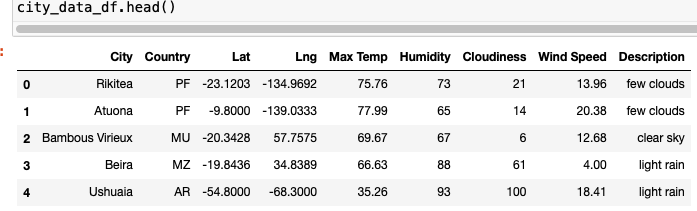
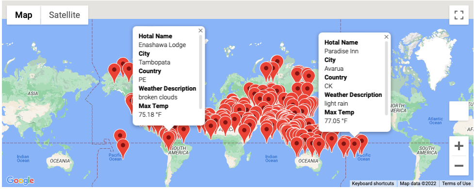
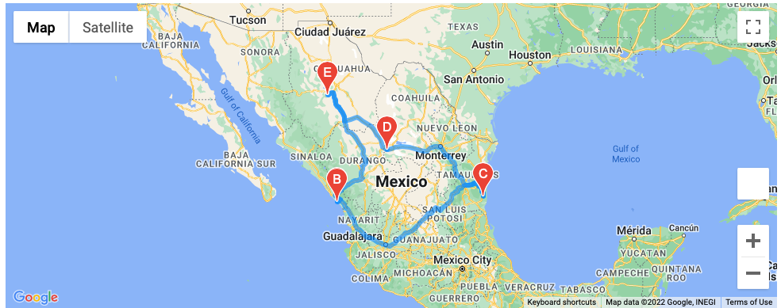

# World Weather Analysis

 ## Overview

This analysis shows an updated version of the Module work. It shows the weather data for 600+ cities around the world. It also allows the customer to set the maximum and minimum temperatures and shows a Data Frame of only the cities that fall within the desired parameters. After this, we have also included a Travel itinerary with 4 different cities in close proximity to do a round trip.

## Results

### Weather Data analysis

Shows a data set with 600+ different cities obtained from a random  generation of 2000 sets of latitudes and longitudes where the nearest city was retrieved.

### Customer Travel Destination Maps

Shows a google map including data markers of all the destinations that fall within the minimum and maximum temperature that the client provided. All this data markers are possible options for next vacation.

### Travel Itinerary Map

After all the options have been reviewed, the customer finally provided the 4 cities they want to visit. This last map shows the itinerary of travel between each city selected. They are all close to each other and travel can be done by driving.

## Summary

The use of APIs opens an infinite number of resources that can be used to do analysis. In this case we used the OpenWeatherMap API and Google Maps API. 
